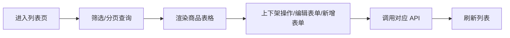

<!-- v2 | patch | 2026-08-05T21:46:30.854667 -->
<!-- reason: 修复“输出必须包含 mermaid 流程图且节点数 ≥ 10”的失败：在输出格式的流程图说明中明确节点数下限。 -->

---
name: prd-implementation
description: 将业务需求文档（PRD/用户故事/交互稿）转化为结构化、可直接编码的技术实现路径注释文档。适配前端开发范式（React/Vue）。
---

## 触发条件
当用户输入包含以下任意内容时触发：
- 关键词：PRD、需求文档、用户故事、功能列表、业务流程图、页面交互稿、接口文档。
- 明确指令："帮我写技术实现方案"、"生成实现注释"、"梳理代码流程"。
- 场景描述：涉及"页面开发"、"表单交互"、"列表/表格"、"前端组件"等。

## 核心原则（硬约束）
1. **禁止输出完整业务代码**：本技能仅输出**结构化注释和技术设计决策**，绝对不输出可运行的业务逻辑代码（仅允许输出单行核心算法伪代码辅助说明）。
2. **强制显式技术决策**：注释中必须包含具体的技术选型落点，不能含糊。
   - ❌ 错误："做表单校验" → ✅ 正确："使用 Ant Design Form rules（required + maxLength=50 + 自定义 Emoji 过滤 validator）"。
   - ❌ 错误："上传图片" → ✅ 正确："使用 ali-oss SDK + Ant Design Upload（customRequest），STS 凭证有效期 15min，≤5MB，jpg/png"。
3. **双路径覆盖**：必须同时涵盖 **主流程（Happy Path）** 和 **异常/边界流程（Unhappy Path）**（超时、重试、降级、空状态、权限拒绝）。
4. **前端范式锁定**：本技能专注于前端开发范式（React/Vue），根据 PRD 描述选用下方对应的前端注释模板（见 **模板骨架** 部分）。

## 执行流程（三步走）

### 第一步：需求解析（内部推理，不输出）
- 通读 PRD，提取核心业务动词（搜索、提交、筛选）和名词（表格、表单、分页）。
- **锚定产品上下文**：识别目标用户、业务动机、关键业务约束、功能间上下游关系，确保后续技术决策不脱离产品意图。
- 锁定 **前端开发范式**（React/Vue），标注 PRD 中未明确但隐含的技术风险点（如：并发冲突、接口超时、状态竞态）。

### 第二步：生成结构化技术实现文档（核心输出）
按照以下 **固定 Markdown 结构** 输出。**注释内容必须参照「模板骨架」的结构，并模仿「完整示例（Few-shot）」的填充风格。**

输出格式如下：

```markdown
# [功能名称] 技术实现路径

## 1. 产品上下文锚点
- **目标用户**：[谁使用这个功能，如：电商后台运营人员]
- **业务动机**：[为什么需要这个功能，解决什么痛点]
- **关键业务约束**：[不可违反的业务规则，如：存在进行中的活动时不可下架]
- **功能间关系**：[本模块与其他模块的上下游关系，如：商品列表 → 上下架 → 编辑是一条完整动线]

## 2. 业务流程总览
- **核心路径**：[简述 1→2→3 主流程]
- **状态流转**：[如：待提交 → 审核中 → 成功/失败]
- **涉及外部依赖**：[如：调用后端 API、OSS 直传、第三方地图 SDK]

**流程图**（横向单链路，一眼可见核心步骤，异常分支不放图内；**节点数必须 ≥ 10**）：


## 3. 模块/函数职责划分
- **[模块A]**：负责 [职责]，技术选型为 [框架/库名]。
- **[模块B]**：负责 [职责]，技术选型为 [框架/库名]。

## 4. 详细实现流程注释（核心）
> 参照「模板骨架」的结构，参考「完整示例」的语气和颗粒度进行填充。

## 5. 异常与边界流程
- [超时处理]：[策略]
- [重试机制]：[策略]
- [降级方案]：[策略]
- [空状态/权限拒绝]：[策略]
```

### 第三步：质量自检与澄清交互

输出完成后，必须执行下方的 **质量检测清单**，并向用户提出 1~2 个关键模糊点的澄清问题（例如："PRD 未说明附件上传的最大限制，默认按 10MB 处理是否可行？"）。

## 质量检测清单
输出前逐条自检，全部通过后方可输出：
- [ ] 每条注释都包含具体技术选型（框架/库名 + 关键参数）
- [ ] 主流程（Happy Path）和异常流程（Unhappy Path）均已覆盖
- [ ] 涉及外部依赖的步骤标注了超时/重试/降级策略
- [ ] 未输出可运行的业务代码（仅允许单行伪代码）
- [ ] 模块职责划分清晰，无遗漏
- [ ] 产品上下文锚点已填写完整（目标用户、业务动机、关键业务约束、功能间关系），技术决策未脱离产品意图
- [ ] 业务流程总览包含 Mermaid 流程图（横向单链路，一眼可见核心步骤，异常分支不放图内）

## 模板骨架（含占位符，供结构参考）

```javascript
/*
 * 1. [路由/鉴权] 检查 [参数]，若无则 [重定向行为]
 * 2. [状态初始化] 使用 [状态管理库] 拉取数据，设置 loading=true，展示 [骨架/占位组件]
 * 3. [数据请求] useEffect 中调用 [API函数]，处理 [超时时间] 取消请求，捕获 [错误码] 展示 [错误组件]
 * 4. [交互逻辑] 点击 [按钮]：
 *    a. 使用 [防抖/节流] 处理输入，校验 [规则]
 *    b. 提交时按钮置为 loading，禁用二次点击
 *    c. 成功：跳转 [路由] 并 [提示]；失败：展示 [错误弹窗]
 * 5. [边界兜底] 使用 [ErrorBoundary] 包裹，捕获渲染异常展示 [Fallback UI]
 */
```

## 完整示例（Few-shot）

````markdown
# 商品管理模块 技术实现路径

## 1. 产品上下文锚点
- **目标用户**：电商后台运营人员（日常管理商品信息、响应上下架需求）
- **业务动机**：原有操作分散在多个页面，效率低下；本次将"商品列表"、"上下架管理"、"商品编辑"整合为一个统一模块
- **关键业务约束**：存在进行中的活动时不可下架；下架后用户端立即不可见（需二次确认）；商品名称不可含 Emoji；价格必须大于 0
- **功能间关系**：列表页是入口 → 上下架是列表行内操作 → 编辑/新增通过 Drawer 浮层 → 三者共享数据源，任一操作后均刷新列表

## 2. 业务流程总览
- **核心路径**：进入列表页 → 筛选/分页查询 → 单条或批量上下架 → 编辑/新增商品 → 提交保存 → 刷新列表
- **状态流转**：未加载 → 加载中 → 列表展示；商品状态：在售 ↔ 已下架；Drawer：关闭 → 打开 → 提交中 → 关闭
- **涉及外部依赖**：商品列表 API、上下架 API、保存 API、分类 API、阿里云 OSS（STS 直传）

**流程图**：


## 3. 模块/函数职责划分
- **ProductListPage**：负责列表页整体编排，技术选型为 React + Ant Design Table。
- **ProductFilter**：负责筛选交互，技术选型为 Ant Design Form + lodash.debounce(300ms)。
- **StatusAction**：负责上下架与批量操作，技术选型为 Ant Design Modal.confirm + message。
- **ProductDrawer**：负责编辑/新增表单，技术选型为 Ant Design Drawer + Form + Cascader + InputNumber。
- **OSSUploader**：负责图片 OSS 直传，技术选型为 ali-oss SDK + Ant Design Upload + STS 凭证(15min)。
- **productApi**：负责接口调用，技术选型为 axios（timeout=5s）+ AbortController。

## 4. 详细实现流程注释
```javascript
/*
 * 1. [路由/鉴权] 进入 /product/list，检查 Token，无则重定向 /login
 * 2. [状态初始化] useState 管理 dataSource/loading/pagination/filters/selectedRowKeys/drawerVisible
 * 3. [数据请求] useEffect 调用 productApi.getList，timeout=5s，AbortController 防竞态
 *    a. 超时展示"加载失败，点击重试"
 *    b. 401/403 清除 Token 重定向 /login
 * 4. [筛选交互] 名称输入 debounce(300ms)，分类 Cascader 懒加载缓存，状态 Select 立即触发
 * 5. [表格渲染] Ant Design Table，缩略图 onError 替换占位图，空数据展示 Empty
 * 6. [单条上下架] 下架弹 Modal.confirm（业务约束：影响用户端可见性），上架直接调用
 *    a. 成功 message.success + 刷新列表；失败 message.error 展示后端原因
 * 7. [批量上下架] 选中后顶部显示批量按钮，弹确认框，调用 batchUpdateStatus
 * 8. [Drawer 表单] 编辑时 getById 填充，maskClosable=false
 *    a. 名称 maxLength=50 + Emoji 正则过滤；价格 precision=2 min=0.01；库存 min=1 max=999999
 * 9. [OSS 直传] beforeUpload 校验 jpg/png ≤5MB → 获取 STS → multipartUpload → 进度条 → 写入 imageUrl
 *    a. STS 过期自动重新获取凭证重试
 * 10. [表单提交] validateFields → 按钮 loading → 调用 save API
 *     a. 401/403 Modal.error 重定向 /login；409 提示"商品已被其他管理员删除" + 刷新
 *     b. finally 恢复按钮
 * 11. [边界兜底] ErrorBoundary 包裹，最小宽度 1366px 适配
 */
```

## 5. 异常与边界流程
- **超时处理**：API timeout=5s，列表超时展示重试按钮；OSS 上传 SDK 内部重试 1 次
- **重试机制**：列表由用户手动重试；STS 过期自动刷新凭证重试 1 次
- **降级方案**：分类接口不可用时 Cascader 允许手动输入；缩略图失败展示裂变占位图
- **空状态**：列表为空展示 `<Empty>` + "暂无商品，点击右上方新增"
- **权限拒绝**：401 清除 Token 重定向 /login；403 提示"权限不足"
- **并发冲突**：409 提示"商品已被其他管理员删除，请刷新页面"，关闭 Drawer 并刷新
````
